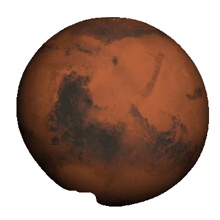

## SPACE BROKERS
Since inception, millions of acres sold!

 
 
## Overview
**Space colonization is here, where are you?**
We're so close to colonize space, at least in theories. But like we'll need a proper real estate system for that, right? Well Space Brokers is there for that exact purpose.
Our website sells properties on space, it uses SOLARI (self made cryptocurrency) for the sale of extraterrestrial property within the confines of our solar system. Don't miss out on this unique opportunity to get your very own piece of land on any planet you want!
 
 
## What it does
Buying property on celestial bodies is exactly what our website offers. 
*Steps to follow-*
 
-_Open website, and pass the human verification test. You gotta show an image to the webcam to be verified as an earthling. The image is at https://i.ibb.co/z75sDpX/Whats-App-Image-2021-02-28-at-3-28-51-PM.jpg
you can also find it in our image gallery. Once verified, you'll be redirected to homepage_
 
 
_Start buying the properties. Choose a celestial body of your choice (we've included 10)_
 
 
_you can have a 3D map view of the celestial body that you're interested in_
 
 
_as soon as you hit buy button, it'll redirect you to the payments page_
 
 
_you need to mine SOLARI using the option there, and then you can use it for payment_
 
 
_Congrats!! you bought a property in Space_
 
 
Now you can take a picture on the land you bought and show it off!
